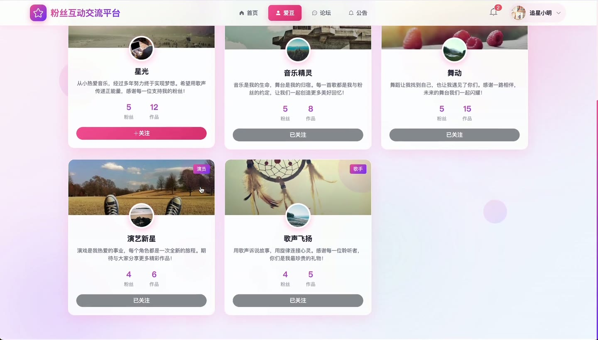
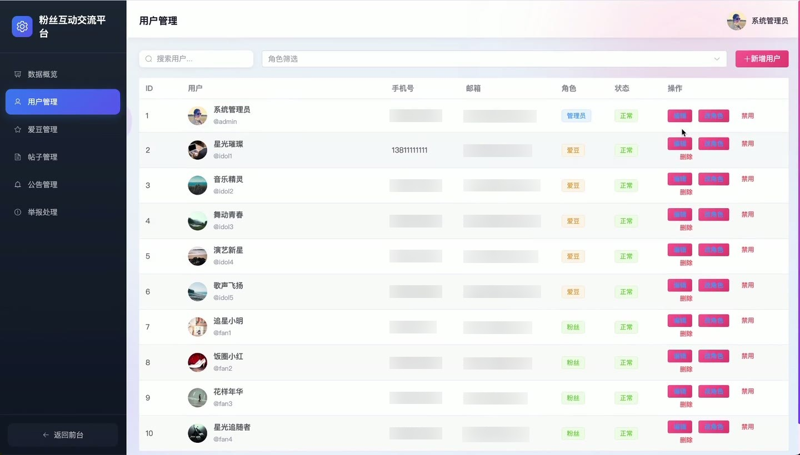

# (附文档)Springboot3+Vue3+MySQL 粉丝互动平台

**技术栈**：Springboot3、Vue3、MySQL

### 系统简介

FanTalk 粉丝互动平台是一个基于 Spring Boot 3 + Vue 3 + MySQL 的前后端分离系统，支持普通用户、爱豆（偶像）和管理员三种角色。系统提供论坛帖子发布与互动、爱豆关注与动态追踪、粉丝互动管理、系统公告、举报处理及数据统计等功能，为粉丝与偶像之间搭建了完整的线上交流社区。
 
### 核心功能
 
### 普通用户端

 
- 注册账号：填写用户名、密码、手机号、邮箱完成注册，支持用户名/手机号/邮箱登录 
- 浏览帖子列表：按分类（综合讨论、追星日常、应援攻略等9大分类）或关键词搜索，支持最新/最热排序 
- 查看帖子详情：展示帖子内容、作者信息、浏览量，支持点赞、取消点赞、收藏、取消收藏操作 
- 发布帖子：填写标题、正文、上传图片、选择分类，发布后自动统计浏览量、点赞数、评论数、收藏数 
- 编辑/删除帖子：仅可编辑或删除自己发布的帖子（逻辑删除，状态置为0） 
- 评论与回复：对帖子发表评论，支持回复指定用户的评论（传 parentId 和 replyToUserId） 
- 举报帖子：选择举报原因提交举报，举报状态为 pending 等待管理员处理 
- 关注爱豆：浏览爱豆列表（支持分类/关键词筛选），点击关注/取消关注，关注后可在动态流查看爱豆动态 
- 查看关注的爱豆列表：分页展示已关注的爱豆及其资料、粉丝数、作品数 
- 查看我的帖子与收藏：分页展示自己发布的帖子列表和收藏的帖子列表 
- 个人资料管理：修改昵称、邮箱、手机号，上传头像，修改密码（需验证原密码） 
- 查看通知列表：分页展示系统通知（like/comment/reply/follow/system 类型），支持标记单条已读或全部已读 
- 查看公开公告：浏览已发布的系统公告（按置顶和发布时间排序）
 
### 爱豆端

 
- 完善爱豆资料：设置艺名、简介、经纪公司、分类、封面图、出道日期等 
- 发布动态：发布图文/视频动态，系统自动统计点赞数和评论数 
- 删除动态：仅可删除自己发布的动态 
- 添加作品：上传作品信息（标题、描述、封面、作品类型如音乐/视频/专辑/影视等、发行日期、外部链接） 
- 删除作品：删除已添加的作品记录 
- 查看粉丝互动：查看粉丝在自己动态下的点赞和评论记录（最近50条） 
- 查看粉丝列表：获取关注自己的粉丝用户列表 
- 查看个人动态详情：查看单条动态的详细内容、点赞状态、评论列表 
- 动态互动管理：接收粉丝的点赞和评论，点赞数/评论数实时更新
 
### 管理员端

 
- 概览统计：查看总用户数、总爱豆数、总帖子数、总动态数、今日新增用户数和今日新增帖子数 
- 日活跃用户统计：查看每日活跃用户数据（基于操作日志） 
- 用户角色分布：查看粉丝、爱豆、管理员三种角色的数量分布 
- 帖子分类统计：查看9个帖子分类各自的帖子数量 
- 用户管理：分页查询用户（按角色/关键词筛选），创建用户、编辑用户信息（昵称/手机/邮箱/头像/密码）、修改用户状态（启用/禁用）、修改用户角色（设置为爱豆时自动创建爱豆资料）、删除用户（不能删除管理员） 
- 爱豆管理：分页查询爱豆列表，编辑爱豆资料（艺名/分类/经纪公司/简介/封面图），删除爱豆（降级为普通用户） 
- 帖子管理：分页查询帖子（按分类/关键词筛选），设置置顶/热门/修改状态，删除帖子（逻辑删除） 
- 公告管理：创建、编辑、删除公告，公告类型支持 system/activity/update/maintenance，可设置置顶和发布状态 
- 举报管理：分页查看举报记录（按状态筛选），处理举报（填写处理结果，将状态改为已处理/驳回）
 
### 技术栈

 后端框架Spring Boot 3 ORMMyBatis-Plus 权限认证Spring Security + JWT 前端框架Vue 3 状态管理Pinia 构建工具Vite 数据库MySQL 文件上传本地文件存储（按日期分目录，支持图片/头像/视频） 密码加密BCryptPasswordEncoder
 
### 交付内容

 
- 后端完整源码 
- 前端完整源码 
- 数据库初始化脚本 
- 万字文档

## 界面展示

---

## 获取完整源码 + 万字文档

本仓库为项目介绍页。**完整前后端源码、数据库初始化脚本、万字项目文档**，请访问 [codekk.top](http://codekk.top) 获取。

可作课程设计 / 毕业设计参考，支持远程部署调试。